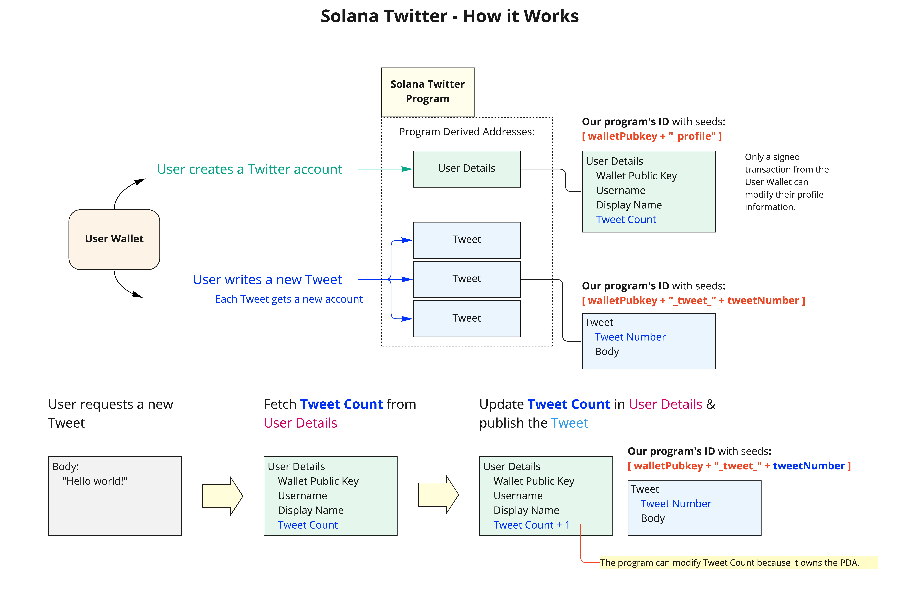

# Solana Twitter

  :bird:    A mock Twitter app built on Solana!   

* How UI Should Work:
  * User opens the page and sees the `Connect Wallet` prompt.
  * Right after they connect their wallet:
    * If their twitter account exists, it loads their account and shows all tweets (`getProgramAccounts`).
    * If their twitter account does not exist, the user sees the input boxes to enter their username and display name. Once they click create account, it loads their account and shows all tweets (`getProgramAccounts`).

* Bugs:
  * [ ] Page doesn't refresh to show new tweets after submitting one.
  * [ ] Add CSS to make this thing look nice